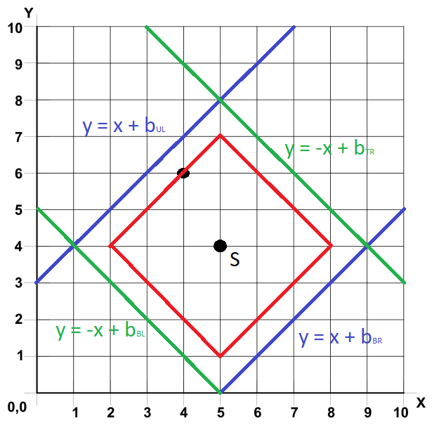

<!-- Entries between SOLUTIONS and RESULTS tags are auto-generated -->

# 🎄 Advent of Code 2022 🎄

## Solutions

<!--SOLUTIONS-->

<!--/SOLUTIONS-->

_Click a badge to go to the specific day._

##  Day 01: Calorie Counting

[Task description](https://adventofcode.com/2022/day/1) - [Complete solution](day01/calorie_counting.py) - [Back to top](#top)  
  
Runtime: 0.627 ms  

### Part One

This day is relatively simple overall, so we'll just take it slow and walk through every step.  

The main skill being tested here is honestly just our ability to read and organize the input. For this day, our input is split into "chunks", where each chunk is a list of calorie values held by each elf. These chunks are separated by a blank line, meaning we can find them by splitting the input on two newlines.  

    chunks = []
    with open('path/to/data.txt') as f:
        for chunk in f.read().split('\n\n'):
            chunks.append(chunk)

Now, to get the total number of calories held by each elf, we can loop over each chunk and sum the value in each line of the chunk. This means that we'll have to convert each value in the chunk to an int instead of a string. The simplest way to do this is by using the `map()` function to apply a function to every element of a given iterable. The built-in `sum()` function will then be super handy for adding them together, as it will add up all the values in a given iterable.  

    per_elf = []
    for chunk in chunks:
        values = map(int, chunk.splitlines())
        per_elf.append(sum(values))

However, this is a **lot** of looping. And if there's one thing python hates, it's looping. Using list comprehension, all of the above lines can be neatly combined:

    with open('path/to/data.txt') as f:
        per_elf = sum(map(int, x.splitlines())) for x in f.read().split('\n\n'))

Finally, the highest value that any elf has can be found using the built-in `max()` function.  

    most_calories = max(per_elf)

### Part Two

Part two asks us to find the total calories held by the three elves with the most calories. We can simply sort our list of calories per elf by using the `sorted()` method. Then, sum the last three elements in the list.

    top_three = sum(sorted(per_elf)[-3:])

Easy peasy!

##  Day 02: Rock Paper Scissors

[Task description](https://adventofcode.com/2022/day/2) - [Complete solution](day02/rock_paper_scissors.py) - [Back to top](#top)  
  
Runtime: 0.867 ms  

### Part One

For day two, we have to take a series of character inputs and use them to play Rock, Paper, Scissors. Each line gives two values: one is the opponent's choice ('A' for rock, 'B' for paper, 'C' for scissors), the other is our choice ('X' for rock, 'Y' for paper, 'Z' for scissors). We can represent this input as a list of tuples.

    # Note: aoc.read_lines() is simply a fancy utility function that will split the input data by line
    rounds = [tuple(x.split(' ')) for x in aoc.read_lines()]

Each line represents one round of the game. The score for any given round is determined by two factors: the option we have chosen `{rock: 1 point, paper: 2 points, scissors: 3 points}` and the result of the round from our perspective `{win: 6 points, draw: 3 points, loss: 0 points}`. We can represent these values using enums.

    class Option(IntEnum):
        ROCK = 1
        PAPER = 2
        SCISSORS = 3

    class Outcome(IntEnum):
        WIN = 6
        DRAW = 3
        LOSS = 0

Finally, let's make a function that determines how many points we get for one round. Our choice is simply dependent on the letter given by the input, while the result is dependent on both our choice and the opponent's choice. A combination of switch statement and if statements can get us there pretty easily.

    def translator(opponent: str, me: str) -> int:
        match me:
            case 'X':
                choice = Option.ROCK
                result = Outcome.DRAW if opponent == 'A' else (Outcome.WIN if opponent == 'C' else Outcome.LOSS)
            case 'Y':
                choice = Option.PAPER
                result = Outcome.DRAW if opponent == 'B' else (Outcome.WIN if opponent == 'A' else Outcome.LOSS)
            case 'Z':
                choice = Option.SCISSORS
                result = Outcome.DRAW if opponent == 'C' else (Outcome.WIN if opponent == 'B' else Outcome.LOSS)
        return choice + result

Theoretically, we could just loop through our list of rounds, get the points of each round and sum it like so.

    part_one = sum([translator(x) for x in rounds])

But we're better than that! Because of the way the game works, there is a finite number of independent inputs to this function: `('A', 'X'), ('A', 'Y'), ('A', 'Z'), ('B', 'X'), etc, etc`. The output of this function will be the same for any given input. Likewise, our input of rounds is actually just a collection of each of these inputs n times. Instead of calling our function once for each round, why don't we call it once for each input? We can easily count the number of each input using the `Counter` object, which counts a given iterable into a dict of \[key,int\] values.

    rounds = Counter([tuple(x.split(' ')) for x in aoc.read_lines()])
    part_one = sum(v * translator(*k) for k, v in rounds.items())

### Part Two

This time, the `XYZ` inputs no longer represent the option we have chosen, but instead represent the outcome of the round. This is no big deal, all we have to do is slightly adjust our original function.

    def translator2(opponent: str, me: str) -> int:
        match me:
            case 'X':
                result = Outcome.LOSS
                choice = Option.ROCK if opponent == 'B' else (Option.PAPER if opponent == 'C' else Option.SCISSORS)
            case 'Y':
                result = Outcome.DRAW
                choice = Option.ROCK if opponent == 'A' else (Option.PAPER if opponent == 'B' else Option.SCISSORS)
            case 'Z':
                result = Outcome.WIN
                choice = Option.ROCK if opponent == 'C' else (Option.PAPER if opponent == 'A' else Option.SCISSORS)
        return choice + result

    part_two = sum(v * translator2(*k) for k, v in rounds.items())

Tada! Nice and simple, and with minimal looping!

##  Day 03: Rucksack Reorganization

[Task description](https://adventofcode.com/2022/day/3) - [Complete solution](day03/rucksack_reorganization.py) - [Back to top](#top)  

Runtime: 1.232 ms  

### Part One

Here we arrive at one of those advent of code days that is just totally broken by using sets. For those not in the know, a `set` is an unmutable collection of unique, unordered values. For instance, if you were to make a `set` out of this list: `[3, 5, 3, 1, 3]`, the `set` would contain the following values: `{1, 3, 5}`. The best way to think of a `set` visually is as a single circle in a larger venn diagram.

First thing's first though, let's read our input. Each line is a list of characters that are contained in one rucksack. We can make a list of lists where each inner list contains every item within the rucksack.

    rucksacks = [list(x) for x in aoc.read_lines()]

Then, we have to determine what the "priority" of each item is. `{'a'-'z': 1-26, 'A'-'Z': 27-52}`. We can iterate through the lowercase and uppercase letters using the `ascii_lowercase` and `ascii_uppercase` functions from the `string` library. The `enumerate` function will then let us loop through these while extracting both the current index and the current value.

    priorities = {char: i+1 for i, char in enumerate(list(ascii_lowercase) + list(ascii_uppercase))}

Finally, we need a function that can find the item contained in both rucksack compartments. If we split the string in half, and change each half into a set, we can find the `intersection` of those sets to determine which item(s) is contained in both. The `intersection` of two sets can be found using the bitwise `&` operator

    def check_compartment(items: str) -> int:
        common_item = set(items[len(items)//2:]) & set(items[:len(items)//2])
        return list(common_item)[0]

    part_one = sum(priorities[check_compartment(x)] for x in rucksacks)

### Part Two

This time, we need to get every group of three rucksacks and find the common item between all of them. First, we'll need to have a function that can get that common item. Once again, we can use `intersection`. However, this time we'll call it in a different way.

    def check_group(sacks: list[str]) -> int:
        common_item = set.intersection(*map(set, sacks))
        return list(common_item)[0]

`map(set, sacks)` will convert all of our sacks (represented by lists of strings) into sets of strings instead. Then, we can use the `*` operator to unpack that list into the arguments of `set.intersection`. The result is our one common item.

Using the `range` function, we can easily step over our list of rucksacks, taking care to split them into groups of three. The first argument of range is the starting value of the iteration, the second is the ending value, and the third argument is the step -- the size of each jump in iteration. So `range(0, len(rucksacks), 3)` will iterate over the values `(0, 3, 6, 9, 12, ...)` all the way until the end of our rucksack list.

    sum(priorities[check_group(rucksacks[i:i+3])] for i in range(0, len(rucksacks), 3))

##  Day 04: Camp Cleanup

[Task description](https://adventofcode.com/2022/day/4) - [Complete solution](day04/camp_cleanup.py) - [Back to top](#top)  

Runtime: 1.313 ms  

### Part One

Today's problem asks us to essentially find the overlap between two ranges. On paper, this should be a slam dunk use of sets. However, on further thought, sets might not be ideal. While still a perfectly valid solution, creating a set out of each of these inputs involves creating the full ranges, which hurts us both in time and memory. Instead, we have all the information we need when parsing the lines. If we assume elf `a` and elf `b`, our input provides a list of `amin`, `amax`, `bmin`, and `bmax`

    def parse_line(line: str) -> tuple[int,int,int,int]:
        a, b = line.split(',')
        amin, amax = map(int, a.split('-'))
        bmin, bmax = map(int, b.split('-'))
        return amin, amax, bmin, bmax
    assignments = [parse_line(x) for x in aoc.read_lines()]

Our goal is then to find out if the range of `a` (`amin-amax`) contains the entire range of `b` (`bmin-bmax`) or vice versa:

    amin            amax        amin       amax
    |---------------|           |----------|
       |--------|               |---------------|
       bmin     bmax            bmin            bmax

As seen above, this occurs when both `amin <= bmin and amax >= bmax` or when `bmin <= amin and bmax >= amax`. We can simply compare the various min/max values to each other to determine this for each line.

    def contains(min_a: int, max_a: int, min_b: int, max_b: int) -> bool:
        return min_a <= min_b and max_a >= max_b or min_b <= min_a and max_b >= max_a

    part_one = len([x for x in assignments if contains(*x)])

### Part Two

For part two, we just need to see if there's any overlap between the two assignments. Instead of checking for when this is true, it's much easier to find when it is false.

    amin         amax
    |------------|
                    |------|
                    bmin   bmax

If `a` ends before `b` starts (or vice versa), then there is no overlap. The inverse of that will tell us when overlap occurs for a given line.

    def overlap(min_a: int, max_a: int, min_b: int, max_b: int) -> bool:
        return not (max_a < min_b or max_b < min_a)

    part_two = len([x for x in assignments if overlap(*x)])

Tada! Believe it or not, I found this solution to be about 4 times faster than the `set`-based solution, though both were more than sufficiently fast.

##  Day 05: Supply Stacks

[Task description](https://adventofcode.com/2022/day/5) - [Complete solution](day05/supply_stacks.py) - [Back to top](#top)  

Runtime: 1.559 ms  

### Part One

Today's issue has us dealing with moving crates between a series of stacks. The first question we have to ask is "how do we want to represent the data?". Each movement will involve moving `n` crates from some stack `a` to some stack `b`. While my gut instinct was to use a series of `deque` objects, since this is just a series of LIFO stacks, the fact that we have to move multiple crates at once actually makes me rather use a series of lists. This is because there's no way to pop multiple values from a `deque` at the same time, whereas with lists, I can slice multiple values off at once. So we can represent our stacks of crates using this structure.

    Stacks = dict[int, list[str]]

With our data structure in place, let's read the input, which is split into two chunks: our initial state of stacks and the movements we need to perform. Let's start with the initial state.

        [D]        # <-- This is the final element of a stack
    [N] [C]    
    [Z] [M] [P]    # <-- This is the 0th element of a stack
     1   2   3     # <-- Last row is the ID of a given stack

Here we see how the input is structured. We want to look at it from the bottom-up to make our initial state of `Stacks`. Let's create a function that does that.

    def parse_state(state: str) -> Stacks:
        lines = state.splitlines()
        crates, stacks = lines[:-1], lines[-1]
        return {int(stack_no): [row[i] for row in reversed(crates) if row[i] != ' '] 
                for i, stack_no in enumerate(stacks) if stack_no != ' '}

    initial_state, movements = aoc.read_chunks()
    stacks = parse_state(initial_state)

The bottom line (`stacks`) contains our stack_ids and a bunch of spaces we don't care about. Meanwhile, every other line (`crates`) contains the letters of our crates and a bunch of other characters we don't care about. Notice that the letter of a crate is always in the same index as the stack id itself. If we enumerate over `stacks` (taking care to skip spaces), we are left with every index that contains the letters in that stack. Then we can loop backwards over `crates` and grab that index in each row (once again skipping blank lines).

With that out of the way, all that's left is to move the crates around. We can use `str.split()` to pull out relevant data from each movement line, like so:

    m = movement.split()
    amount, start, end = int(m[1]), int(m[3]), int(m[5])

Once we have that, it's as simple as pulling `amount` number of crates from `start` stack and placing them into `end` stack. Be sure you remember to remove the crates from the `start` stack along the way.

    def move(stacks: Stacks, movement: str) -> Stacks:
        m = re.match(r'move (\d+) from (\d+) to (\d+)', movement).groups()
        amount, start, end = int(m[0]), int(m[1]), int(m[2])

        to_move = stacks[start][-amount:]        # Grab the crates that need moved
        stacks[start] = stacks[start][:-amount]  # Remove those crates from the start stack
        stacks[end].extend(reversed(to_move))    # Place them into the end stack
        return stacks

Finally, let's call this function once for each movement. The `reduce` function in the `functools` library helps a lot here. Given a function, an iterable, and an initial state, you can apply the function from left to right on the iterable and obtain the final value. For instance `reduce(lambda x,y: x*y, numbers, 1)` will multiply every value of `numbers` together, starting with the value 1.

    stacks = reduce(lambda x,y: move(x, y), movements.splitlines(), stacks)
    part_one = ''.join([q[-1] for q in stacks.values()])

### Part Two

Part two doesn't change things a whole lot for us. Instead of reversing the crates that are moved, we want to keep them in the same order. To do that, we can just edit our move function a little bit:

    def move(stacks: Stacks, movement: str, reverse: bool = True) -> Stacks:
       m = movement.split()
        amount, start, end = int(m[1]), int(m[3]), int(m[5])

        retval = stacks.copy()
        to_move = stacks[start][-amount:]
        retval[start] = stacks[start][:-amount]
        retval[end] = stacks[end] + tuple(reversed(to_move) if reverse else to_move)
        return retval

A new optional argument `reverse` was added. If `reverse` is `True`, we will reverse the moved crates (like in part 1). However, now we can pass `False` in, and it will give us our answer for part two. In addition, the input dictionary was copied so that we no longer directly **mutate** the input. This will allow us to run both parts in one script nice and neatly.

    movements = movements.splitlines()

    stacks1 = reduce(lambda x,y: move(x, y), movements, stacks)
    yield ''.join([q[-1] for q in stacks1.values()])

    stacks2 = reduce(lambda x,y: move(x, y, reverse=False), movements, stacks)
    yield ''.join([q[-1] for q in stacks2.values()])

##  Day 06: Tuning Trouble

[Task description](https://adventofcode.com/2022/day/6) - [Complete solution](day06/tuning_trouble.py) - [Back to top](#top)  

Runtime: 2.001 ms  

### Part One

Today's problem is kind of disappointingly easy, as it's just asking us to do some basic string manipulation. Given a long string of characters, we need to find the first window of 4 unique characters. The simplest way to determine that would be to loop through the string, putting each group of 4 characters into a set, and then comparing the length of that set to the length of the window. I guess let's make a function that does that.

    def find_marker(message: str, window: int) -> int:
        for i in range(window, len(message)):
            if len(set(message[i-window : i])) == window:
                return i

    message = aoc.read_data()
    yield find_marker(message, window=4)

And there we have it. If we want to get a little spicier, we can add some list comprehension to the function.

    def find_marker(message: str, window: int) -> int:
        return next(i for i in range(window, len(message)) if len(set(message[i-window:i])) == window)

### Part Two

We uhhh....just have to change the window size to 14...

    yield find_marker(message, window=14)

##  Day 07: No Space Left On Device

[Task description](https://adventofcode.com/2022/day/7) - [Complete solution](day07/no_space_left_on_device.py) - [Back to top](#top)  

Runtime: 1.938 ms  

### Part One

Finally, something a bit more interesting! This time we're tasked with making a folder structure using the terminal output from a PC. There are definitely many ways to approach this, but I ended up taking a class-based approach, because classes are fun! The terminal will establish the existence of various files and directories, so let's represent those as `dataclasses`, starting with a simple `File`.

    @dataclass
    class File:
        name: str
        size: int

The `Directory` object is going to be a little more complicated. It has to track not only its name, but the things within it. On top of that, a `Directory` must be able to navigate to its parent directory in the case of a `$cd ..` command. Lastly, in the case of a `$cd /` command, we have to navigate all the way back to the top.

    @dataclass
    class Directory:
        name: str = field(default='')
        parent: Directory = field(default=None, repr=False)
        contents: dict[str, File|Directory] = field(init=False, repr=False, default_factory=dict)

        def __getitem__(self, key: str) -> File | Directory:
            if key == '..': return self.parent
            if key == '/':  return self.top

            if key not in self.contents:
                self.contents = Directory(name=key, parent=self)
            return self.contents[key]

        @property
        def top(self) -> Directory:
            return list(self.parents())[-1]

        def parents(self) -> Generator[Directory]:
            level = self
            yield level
            while (level := level.parent) is not None:
                yield level

We can accomplish all of our navigation logic using the `__getitem__` override shown above. It handles our `$cd ..` and `$cd /` commands nice and cleanly, and if we try to navigate into a child directory that does not yet exist, it will be created and added to the contents of our current directory. The `parents()` function will iterate over each parent until it reaches `None` (meaning we've reached the top), and the `top` property is used to get that top level of the folder structure, which helps with `$cd /`.

Next, we have to add a way to add things to the directory. Since our `$ls` output is a list of data in the format of either `dir <directory_name>` or `<file_size> <file_name>`, let's accept that list into our `add_content` function.

    class Directory:
        ...
        def add_content(self, content: list[str]) -> Directory:
            for line in content:
                a, b = line.split()
                if a == 'dir' and b not in self.contents:
                    self.contents[b] = Directory(name=b, parent=self)
                else:
                    self.contents[b] = File(name=b, size=int(a))
            return self

We have now established enough to create the entire `Directory` tree, so let's parse the input and put it to action. The input is a series of commands that can be split on the string: `$ `. This automatically groups each command with its relevant data. Let's make a function that can then take these commands and make our `Directory` tree.

    def build_tree(commands: list[str]) -> Directory:
        cwd = Directory()
        for cmd in commands:
            if cmd.startswith('cd'):
                cwd = cwd[cmd.split()[-1]]
            elif cmd.startswith('ls'):
                cwd = cwd.add_content(cmd.splitlines()[1:])
        return cwd.top

    commands = aoc.read_data().split('$ ')
    top_level = build_tree(commands)

Perfect! All that's left to do is calculate the size of each `Directory`. A few things worth noting here:
* A directory's name is not necessarily unique. We need to find a way to get the full path of a directory.
* A directory's size includes the sizes of all child directories.

With these in mind, let's make a few more functions for our `Directory` class.

    class Directory:
        ...
        @property
        def path(self) -> str:
            return '/' + '/'.join(reversed([x.name for x in self.parents()]))

        @cached_property
        def size(self) -> int:
            return sum(x.size for x in self.contents.values())

        def size_report(self) -> Counter[str]:
            retval = Counter({self.path: self.size})
            for child in self.contents.values():
                if isinstance(child, Directory):
                    retval |= child.size_report()
            return retval

    sizes = top_level.size_report()
    yield sum(x for x in sizes.values() if x <= 100_000)

The `path` property will get us the full name from top to bottom. The `size` property returns the sum of the size of all children. This works because `size` is a property on both `File` and `Directory` objects. Finally, the `size_report` function will recursively give a dictionary pairing each unique directory with its size. Last but not least, we just need to add up all the sizes that are less than 100,000.

### Part Two

Part two doesn't require us to make any drastic changes to our class structures (phew!). Instead, we just need to figure out the most efficient `Directory` to delete. Luckily, it's incredibly easy to get all of the information needed.

    needed_space = 30_000_000 - (70_000_000 - sizes['/'])
    yield min(x for x in sizes.values() if x >= needed_space)

##  Day 08: Treetop Tree House

[Task description](https://adventofcode.com/2022/day/8) - [Complete solution](day08/treetop_tree_house.py) - [Back to top](#top)  

Runtime: ...  

### Part One

I can't believe it's day 8 and we're only just now breaking out numpy! Numpy is a fantastic and well-supported library for doing data analysis in python. If you aren't familiar with numpy, I unfortunately won't be going through **all** of the details here, but [here](https://numpy.org/doc/stable/user/quickstart.html) is a very helpful tutorial to get you started a bit.

In today's problem, we're given a grid of tree heights, and we're asked to see which trees are visible from any edge (above, right, below, left). We can very easily convert our input into a 2d numpy array of ints.

    trees = np.array(aoc.read_grid(), dtype=int)

What we're really looking for is the rolling maximum from any edge. For instance,

    Given:                                    Rolling Max:
    30373                                     33377
    25512                                     25555
    65332    Looking from the left edge ->    66666
    33549                                     33559
    35390                                     35599

Luckily, numpy has a function that can help us out here: `np.maximum.accumulate`. This will calculate the rolling maximum over a given array on a given axis (0 for vertical, 1 for horizontal). That alone won't give us an answer though. We need to know when any tree is higher than the tree before it. This means we want an array of booleans (`true` if the tree is visible, `false` if it is not). When looking from a given edge, the first row/column will always be visible. So given our example...

    Given:                                    We want:
    30373                                     TFFTF
    25512                                     TTFFF
    65332    Looking from the left edge ->    TFFFF
    33549                                     TFTFT
    35390                                     TTFTF

For one edge (let's say from the top), this can be accomplished like so:

    visible = np.full(trees.shape, False)
    visible[0] = True
    visible[1:] = trees[1:] > np.maximum.accumulate(trees, axis=0)[:-1]

Different edges would require different slicing, which becomes kind of ugly. Luckily, numpy is there for us again with `np.rot90`, which allows us to rotate an array 90 degrees `n` times. If we always look from the top edge, but rotate our array before looking, we can actually check all four edges using the same logic.

    def visible_from_edge(trees: NDArray, rot: int) -> NDArray:
        ar = np.rot90(trees, rot)
        visible = np.full(ar.shape, False)
        visible[0] = True
        visible[1:] = ar[1:] > np.maximum.accumulate(ar, axis=0)[:-1]
        return np.rot90(visible, 4-rot)

    visible = [visible_from_edge(trees, i) for i in range(4)]
    yield np.count_nonzero(np.logical_or.reduce(visible))

After calling `visible_from_edge` once for each edge, we will be left with 4 boolean arrays. Combining all of those using a bitwise `|` will tell us all trees that are visible.

### Part Two

For part two, we now have to find the tree within the grid that can see the most trees around it. This definitely is more complicated, but we can use a similar approach. Let's start by looking down. For any given tree, the count of visible trees below is going to be the number of trees from the rolling maximum that are less than the value of the tree in question. For instance, let's look at the second row of our example...

    Given:                        Rolling Max:     Visible:
    30373                         -----            -----
    25512 <- Look down from here  -----            -----
    65332                         65332            TTTTT
    33549                         65549            FFTFF
    35390                         65599            FFFFF

Once again, the first row below that is all visible no matter what, but past that the only visible trees are the ones were `tree > rolling_max(column)`. We can apply this and then once again use the rotation strategy from part one to keep our focus only looking down.

    def visible_from_tree(trees: NDArray, rot: int) -> NDArray:
        ar = np.rot90(trees, rot)
        def _on_row(i: int):
            # Get the row (and beyond) in question from the array
            chop = ar[i:]

            # Get the rolling maximum below this row
            rolling_max = np.maximum.accumulate(chop[1:], axis=0)

            # Count all trees below where the rolling max is less than the current tree
            count = np.sum(chop[0] > rolling_max, axis=0)

            # Correct for the bottom row (no visible trees)    
            return np.where(count < len(chop)-1, count+1, count)   
        
        vision = np.array([_on_row(i) for i in range(len(ar))])
        return np.rot90(vision, 4-rot)

The `_on_row` sub-function will get the number of visible trees when looking down from any given row. This method does unfortunately force us to loop over each row twice and each column twice, which isn't as clean as our part one solution, but it's still the best that I could come up with, personally.

##  Day 09: Rope Bridge

[Task description](https://adventofcode.com/2022/day/9) - [Complete solution](day09/rope_bridge.py) - [Back to top](#top)  

Runtime: ...  

### Notes

...  

##  Day 10: Cathode-Ray Tube

[Task description](https://adventofcode.com/2022/day/10) - [Complete solution](day10/cathode-ray_tube.py) - [Back to top](#top)  

Runtime: ...  

### Notes

...  

##  Day 11: Monkey In The Middle

[Task description](https://adventofcode.com/2022/day/11) - [Complete solution](day11/monkey_in_the_middle.py) - [Back to top](#top)  

Runtime: ...  

### Notes

...  

##  Day 12: Hill Climbing Algorithm

[Task description](https://adventofcode.com/2022/day/12) - [Complete solution](day12/hill_climbing_algorithm.py) - [Back to top](#top)  

Runtime: ...  

### Notes

...  

##  Day 13: Distress Signal

[Task description](https://adventofcode.com/2022/day/13) - [Complete solution](day13/distress_signal.py) - [Back to top](#top)  

Runtime: ...  

### Notes

...  

##  Day 14: Regolith Reservoir

[Task description](https://adventofcode.com/2022/day/14) - [Complete solution](day14/regolith_reservoir.py) - [Back to top](#top)  

Runtime: ...  

### Notes

...  

##  Day 15: Beacon Exclusion Zone

[Task description](https://adventofcode.com/2022/day/15) - [Complete solution](day15/beacon_exclusion_zone.py) - [Back to top](#top)  

Runtime: 0.715 ms  

### Part One

Today's problem is deceptively simple. Given a series of sensors and their closest beacons in an xy-plane, we are asked to find how many points along a given line are being read by the sensors. Based on the example input, one might think this is simply a case of finding all of the points that the sensor reads with a given y-value, and then combining them all into a set. However, after looking at the real input, you'll find that our x and y values are far too large to get away with that strategy in a timely manner.

Let's start by looking at one example sensor and beacon combo. We'll say our sensor `S` is at `(5, 4)` and our beacon `B` is at `(4, 6)`

The range `r` of the sensor can be determined by the manhattan distance from the sensor to its closest beacon. This is just a simple distance formula:

$$r = abs(B_x - S_x) + (B_y - S_y)$$

In this case, our distance is `3`. Using the sensor's range, we can draw a diamond around the it representing the range of points that it is scanning.

Given some line `y`, we must then calculate where this diamond crosses `y`. The first step is to calculate the distance of the sensor from that line, `d`. This can be pretty easily found using our distance formula

$$d = abs(y - S_y)$$

For example, let's use `y=3`. In this case, our `d` value would be `abs(3 - 4) = 1`

The s values of the two points where we cross this line can be calculated using all of the values mentioned above:

$$x_1 = S_x - (r-d)$$
$$x_2 = S_x + (r-d)$$

Those two `x` values and all values within them are being scanned by this diamond. The same calculations can then be done on each of the other diamonds. Our answer will be the combinations of each of these ranges. Let's start applying this to some coding. First, we need a distance formula.

    Point = tuple[int, int]

    def dist(p1: Point, p2: Point) -> int:
        return abs(p2[0] - p1[0]) + abs(p2[1] - p1[1])

Next, we need a way to represent all of these sensors. Let's just make a simple class that can carry all this information

    @dataclass
    class Sensor:
        loc: Point
        closest_beacon: Point = field(repr=False)
        range: int = field(init=False, default=0)

        def __post_init__(self):
            self.range = dist(self.loc, self.closest_beacon)
    
    sensors = [Sensor.from_string(line) for line in aoc.read_lines()]

We'll also want a function that can determine the range of points each sensor crosses a given line at. Some of our sensors will not cross the given y value. In these cases, we'll just return `None`. When getting our ranges, we'll have to be careful to filter over these `None` values.

    class Sensor:
        ...

        def cross_row(self, y: int) -> tuple[int, int]:
            dist_from_row = dist(self.loc, (self.loc[0], y))
            if (_range := self.range - dist_from_row) < 0:
                return None
            return self.loc[0] - _range, self.loc[0] + _range

    ranges = set(filter(lambda x: x is not None, [s.cross_row(row) for s in sensors]))

Having all these ranges doesn't quite help us yet, though. Some of these ranges may be overlapping! For instance, if we have two ranges `(6, 10)` and `(8, 14)`, we would instead prefer to represent that as `(6, 14)`. Luckily, we can take a peek at [day 4](#d04) to figure out how to determine if the ranges are overlapping or not. In the function below, we'll recursively reduce our set of ranges to the bare minimum. The total number of points in these ranges can then be determined.

    def reduce_ranges(ranges: set[tuple]) -> set[tuple]:
        for r1, r2 in itertools.combinations(ranges, 2):
            # No overlap
            if r1[1] < r2[0] or r2[1] < r1[0]:
                continue
            # Range 1 fully contains Range 2
            if r1[0] <= r2[0] and r1[1] >= r2[1]:
                ranges.remove(r2)
            # Range 2 fully contains Range 1
            elif r2[0] <= r1[0] and r2[1] >= r1[1]:
                ranges.remove(r1)
            # Partial containment with Range 1 starting first
            elif r1[0] <= r2[0]:
                ranges = (ranges - {r1, r2}) | {(r1[0], r2[1])}
            # Partial containment with Range 2 starting first
            elif r2[0] <= r1[0]:
                ranges = (ranges - {r1, r2}) | {(r2[0], r1[1])}
            return reduce_ranges(ranges)
        return ranges

    ranges = reduce_ranges(ranges)
    range_len = sum([r[1] - r[0] + 1 for r in ranges])

However, this isn't quite it. Our sensors and beacons also occupy space, and they do not count toward this total. No biggie, though, we just have to subtract the number of sensors and beacons that *also* fall within our ranges.

    class Sensor:
        ...

        def points(self) -> set[Point]:
            return {self.loc, self.closest_beacon}

    def within_ranges(ranges: set[tuple], x: int) -> bool:
        for low, high in ranges:
            if low <= x <= high:
                return True
        return False

    occupied = set.union(*[s.points() for s in sensors])
    occupied = [x for x in occupied if x[1] == row and within_ranges(ranges, x[0])]
    part_one = range_len - len(occupied)

### Part Two

Phew! That was a lot! And part two...doesn't get much easier. There is one point in our xy-grid that is not being read by the scanners, and we have to find it. Well, believe it or not there's a reason I went on that geometry spiel for part one. Remember, that each sensor/beacon combo is essentially a diamond on our xy-grid.

We know a couple pieces of important information about our stress beacon
- It is limited to a square with `xmin, ymin = 0` and `xmax, ymax = 4,000,000`
- There is only **one** point not covered by a sensor in this grid

Going back to the diamond representation, using this information, we can surmise that this point **must** be one space away from one (or more) diamonds. Visually, by this I mean that the point of interest could only be somewhere along the yellow line.

Of course, with multiple diamonds, you can't guarantee that any single one will contain the point. But we can say for sure that this will be true for one or more diamonds. Of course, this yellow line is just another diamond with range `r + 1`. Interestingly, we can actually represent the diamond as the cross-section of 4 lines. Because our diamonds are always going to have the same shape, these lines will always have slopes of `+1` or `-1`. Let's draw those lines, with blue representing a slope of `+1` and green representing a slope of `-1`.

No matter what, our point must lie along one of these four lines. Combining all of the diamonds together, we can also guarantee that our point will occur at the intersection at two of these lines (one with a slope of `+1` and one with a slope of `-1`). Below is a more complex example using our same grid as before. All of the positive slopes are represented in blue, and the negative slopes in green. The cross-section of these lines are our points of interest.

So how do we get these points? First we have to get the lines. Using the basic formula for a line, $y = mx + b$, we can find identify our four lines by their y-intercepts: $b_{TL}$ for the upper left line, $b_{TR}$ for the upper right line, $b_{BL}$ for the bottom left line, and $b_{BR}$ for the bottom right line. 

We can solve for our y-intercepts using the points that these lines cross, like so:

$$y = +1*x + b_{TL} => S_y + r + 1 = S_x + B_{TL} => B_{TL} = -S_x + S_y + r + 1$$
$$y = -1*x + b_{TR} => S_y + r + 1 = -S_x + B_{TR} => B_{TR} = S_x + S_y + r + 1$$
$$y = -1*x + b_{BL} => S_y - r - 1 = -S_x + B_{BL} => B_{BL} = S_x + S_y - r - 1$$
$$y = +1*x + b_{BR} => S_y - r - 1 = S_x + B_{BR} => B_{BR} = -S_x + S_y - r - 1$$

Now let's do it programmatically.

    tl = { -s.loc[0] + s.loc[1] + s.range + 1 for s in sensors }
    tr = { s.loc[0] + s.loc[1] + s.range + 1 for s in sensors }
    bl = { s.loc[0] + s.loc[1] - s.range - 1 for s in sensors }
    br = { -s.loc[0] + s.loc[1] - s.range - 1 for s in sensors }

We then want to group our positive and negative slopes and find each intersection. Simply solve for x and y.

    for pb, nb in itertools.product( tl & br, tr & bl ):
        x = ( nb - pb ) // 2
        y = x + pb

However, there can be points that exist at these intersections that don't meet our requirements. We must check to see if:
- The point is within our boundary and
- The point is **not** within a sensor's range

To check for the second condition, let's add a `__contains__` function to our sensor.

    def __contains__(self, p: Point) -> bool:
        return dist(self.loc, p) <= self.range
    
Almost there! Let's just wrap up our loop.

    xy_min = 0
    xy_max = 4_000_000
    for pb, nb in itertools.product( tl & br, tr & bl ):
        x = ( nb - pb ) // 2
        y = x + pb

        if not (xy_min <= x <= xy_max and xy_min <= y <= xy_max):
            continue
        if any([(x, y) in s for s in sensors]):
            continue
        part_two = x * 4_000_000 + y
