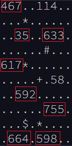
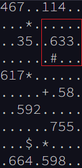
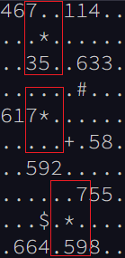
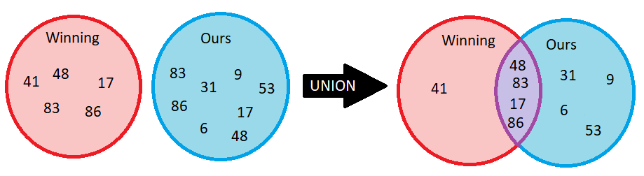

<!-- Entries between SOLUTIONS and RESULTS tags are auto-generated -->

[](https://adventofcode.com/2023)


# 🎄 Advent of Code 2023 🎄

## Solutions

<!--SOLUTIONS-->

[](#d01)
[](#d02)
[](#d03)
[](#d04)
[](#d05)
[](#d06)
[](#d07)
[](#d08)
[](#d09)
[](#d10)
[](#d11)
[](#d12)
[](#d13)
[](#d14)
[](#d15)
[](#d16)
[](#d17)
[](#d18)
[](#d19)
[](#d20)
[](#d21)
[](#d22)
[](#d23)
[](#d24)
[](#d25)

_Click a badge to go to the specific day._

## <a name="d01"></a> Day 01: Trebuchet

[Task description](https://adventofcode.com/2023/day/1) - [Complete solution](day01/trebuchet.py) - [Back to top](#top)  

Runtime: 4.486 ms  

### Part One

A new December begins, and so does a new advent of code! Yippee! Looks like we get the pleasure of starting this year off with some super-duper string manipulation. Always fun.

We start with a list of strings that contain digits within them, like `pqr3stu8vwx`. We must obtain the first and last digit of each string and combine them into one two-digit number--in this case, `38`. The most sensible way to do this is to use our good friend, the regular expression. We could look over each line, finding all digits `(?=(\d))`. Then, simply grab the first and last (which could be the same with only one match) and convert them to a two-digit int. Let's make a function that can do just that.

```python
def pull_digits(line: str) -> int:
    pattern = fr'(?=(\d))'
    matches = re.findall(pattern, line)
    first, last = matches[0], matches[-1]
    return int(f'{first}{last}')

calibrations = aoc.read_data()
part_one = sum(pull_digits(x) for x in calibrations.splitlines())
```

Tada! Not the fastest solution, but it's simple enough. However, I'm not incredibly satisfied with it. Running an individual regular expression over every line doesn't feel very great (and is definitely slow). It'd be much more preferable to run the regex over the entirety of the data and pick it apart after. Let's try that instead.

```python
def pull_digits(calibrations: str) -> Generator[int]:
    matches = re.findall(fr'(?=(\n|\d))', calibrations)
    for key, group in itertools.groupby(matches, lambda x: x == '\n'):
        if key:
            continue
        group = list(group)
        yield int(f'{group[0]}{group[-1]}')

calibrations = aoc.read_data()
part_one = sum(pull_digits(calibrations))
```

This feels much more smooth. We've changed the function to accept the entirety of the data instead of one line. Then we edit our regular expression to match digits and newlines. We can then group our resulting matches by the newlines to get the results for each individual line. Only one loop required, and only one regular expression to parse.

### Part Two

For part two, we are told that the strings also contain the literal words for digits (i.e. "one", "two", or "three"). These strings can also count as digits. Well let's start by defining a map from word to digit:

```python
DIGIT_STRINGS = {
    'zero': '0',
    'one': '1',
    'two': '2',
    'three': '3',
    'four': '4',
    'five': '5',
    'six': '6',
    'seven': '7',
    'eight': '8',
    'nine': '9'
}
```

Next, we have to update our regular expression pattern to also check for these words. This would require a final product of `(?=(\n|\d|one|two|three|etc))`. Finally, we'll have to adjust our existing function to both accept a pattern as a parameter, and to replace any "digit word" matches with their appropriate value.

```python
def pull_digits(calibrations: str, pattern: str) -> Generator[int]:
    matches = re.findall(pattern, calibrations)
    for key, group in itertools.groupby(matches, lambda x: x == '\n'):
        if key:
            continue
        group = list(group)
        first = DIGIT_STRINGS.get(group[0], group[0])
        last = DIGIT_STRINGS.get(group[-1], group[-1])
        yield int(f'{first}{last}')

pattern2 = fr'(?=(\n|\d|{"|".join(list(DIGIT_STRINGS.keys()))}))'
yield sum(pull_digits(calibrations, pattern2))
```

## <a name="d02"></a> Day 02: Cube Conundrum

[Task description](https://adventofcode.com/2023/day/2) - [Complete solution](day02/cube_conundrum.py) - [Back to top](#top)  

Runtime: 0.924 ms  

### Part One

For part two, we are tasked with playing a very boring sounding game with our elf friend--he will repeatedly grab from a bag a handful of random cubes, put them back in the bag, and then repeat a few times. Then for some reason, he will change the number of cubes in the bag in between games, and we'll play again. In doing so, we can gather data from the random pulls regarding how many total cubes of each color are in the bag for each game.

Long story short, this is yet another string manipulation puzzle. We're given a string of the following format and tasked with finding out whether or not that particular game could be played with only `12 red cubes, 13 green cubes and 14 blue cubes`:

    Game 4: 1 green, 3 red, 6 blue; 3 green, 6 red; 3 green, 15 blue, 14 red

There's a lot of numbers and words in this string, but you'd be surprised at how little of it we actually need when it comes down to it. First, we need the game number (`4` in this case). However, because the game numbers move up in chronological order, we really don't need to pull it from the string--we can just assume it.

Next, we need the largest number of each cube color that appeared in this game. In this case, it would be `14 red cubes, 3 green cubes, and 15 blue cubes`. The rest of the numbers do not make any impact on this. Because of this, we can actually make our string manipulation a little easier: let's just ignore everything after the `:`, and then ignore every `,` and `;`. This will leave us with a string like so:

    1 green 3 red 6 blue 3 green 6 red 3 green 15 blue 14 red

We could then split this string by spaces and loop through pretty smoothly.

```python
for i, game_log in enumerate(aoc.read_lines(), start=1):
    game_log = game_log.split(': ')[1].replace(',', '').replace(';', '').split(' ')
```

Next, it would really help if we could iterate over two elements at once, so that we could get `(1, green), (3, red), (6, blue), ...`. Let's make a quick function to help with that.

```python
def pairwise(iterable):
    a = iter(iterable)
    return zip(a, a)
```

We can throw that into a loop in our main block of code. While we're at it, we'll need somewhere to sort and store the cube counts. Let's grab a default dictionary with `set` type:

```python
for i, game_log in enumerate(aoc.read_lines(), start=1):
    cube_counts = defaultdict(set)
    game_log = game_log.split(': ')[1].replace(',', '').replace(';', '').split(' ')
    
    for amount, color in pairwise(game_log):
        cube_counts[color].add(int(amount))
```

Lastly, all we really need from the information we've gathered it the max count of each cube color. We can then compare that to the test values mentioned above. Let's put it all together:

```python
TEST_CUBES = {
    'red': 12,
    'green': 13,
    'blue': 14
}

part_one = 0
for i, game_log in enumerate(aoc.read_lines(), start=1):
    cube_counts = defaultdict(set)
    game_log = game_log.split(': ')[1].replace(',', '').replace(';', '').split(' ')
    
    for amount, color in pairwise(game_log):
        cube_counts[color].add(int(amount))
    max_cubes = {k: max(v) for k, v in cube_counts.items()}

    if all(v <= TEST_CUBES[k] for k, v in max_cubes.items()):
        part_one += i
```

## Part Two

Part two doesn't really change a whole lot. Instead of comparing against a test game, we need to calculate the "power" of a set of cubes by getting the product of the max number of each cube color. Luckily, we already have all the information needed for this. We just have to throw a quick extra line in.

```python
part_one, part_two = 0, 0
for i, game_log in enumerate(aoc.read_lines(), start=1):
    cube_counts = defaultdict(set)
    game_log = game_log.split(': ')[1].replace(',', '').replace(';', '').split(' ')
    
    for amount, color in pairwise(game_log):
        cube_counts[color].add(int(amount))
    max_cubes = {k: max(v) for k, v in cube_counts.items()}

    if all(v <= TEST_CUBES[k] for k, v in max_cubes.items()):
        valid_game_total += i
    power += reduce(lambda x,y: x*y, max_cubes.values())
```

## <a name="d03"></a> Day 03: Gear Ratios

[Task description](https://adventofcode.com/2023/day/3) - [Complete solution](day03/gear_ratios.py) - [Back to top](#top)  

Runtime: 4.809 ms (in office)  

### Part One

Today's test has us searching over a grid of characters in an attempt to find `part numbers`. These can be identified as any number that is adjacent to a non-period, non-digit symbol. Adjacencies can include diagonal. In the example below, the part numbers have been highlighted.



Right away, we can run into a few traps here. It might make sense to approach this as a grid. This would even allow us to get into some sneaky numpy shenanigans that could ease the adjacency detection. However, if we were to take this approach, we would have a hard time getting the entirety of a part number. For example, the part number `617` is adjacent to a `*` symbol. We could pretty easily identify that the `7` is adjacent to the `*`, but to then get the entire number of `617` would be a lot of extra work.

However, if we approach this only as a block of text, it's going to be very hard to discern what it means to be adjacent. We still need some sense of location, which means that the concept of a grid is still useful. Maybe we can use both ideas! Let's start with the whole numbers and try to identify which ones are part numbers. We can do this using (once again) regular expressions.

```python
schematic = aoc.read_data()
for _match in re.finditer(r'(\d+)', schematic):
    val = _match.group()
```

Using re.finditer, we can iterate over each whole digit within the entire block of text. The `_match` object stores both the start of the match and its value. Using the start of the match, we can determine the `(x, y)` location of the number in the corresponding grid.

```python
schematic = aoc.read_data()
schematic_grid = schematic.splitlines()
line_length = len(schematic_grid[0]) + 1

for _match in re.finditer(r'(\d+)', schematic):
    y, x = divmod(_match.start(), line_length)
    val = _match.group()
```

Next, we need to check every point adjacent to the number. Because the number could be of any digit length, we have to use the length of the match to determine how wide of an area to search. In the example below, for part number `633`, we have to check all of the highlighted points. This part number starts at `(6, 2)`, and so we'll need to check every point within `y-range (1, 3)` and `x-range (5, 9)`.



With that in mind, we can use a combination of `itertools.product` and `range` along with the information we've already gathered to easily iterate over all of these points.

```python
schematic = aoc.read_data()
schematic_grid = schematic.splitlines()
line_length = len(schematic_grid[0]) + 1

for _match in re.finditer(r'(\d+)', schematic):
    y, x = divmod(_match.start(), line_length)
    val = _match.group()
    for adj_y, adj_x in itertools.product(range(y-1, y+2), range(x-1, x+len(val)+1)):
        try:
            adj_val = schematic_grid[adj_y][adj_x]
        except IndexError:
            continue
```

Finally, we just need to check if any of those adjacent points contain a symbol of interest. Because we don't explicitly know which symbols we're looking for, it will be easier to check which symbols *don't* interest us.

```python
schematic = aoc.read_data()
schematic_grid = schematic.splitlines()
line_length = len(schematic_grid[0]) + 1

non_symbols = {str(n) for n in range(10)} | {"."}

part_total = 0
for _match in re.finditer(r'(\d+)', schematic):
    y, x = divmod(_match.start(), line_length)
    val = _match.group()
    for adj_y, adj_x in itertools.product(range(y-1, y+2), range(x-1, x+len(val)+1)):
        try:
            adj_val = schematic_grid[adj_y][adj_x]
        except IndexError:
            continue

        if adj_val not in non_symbols:
            part_total += int(val)
```

### Part Two

Part two has us instead checking for `gears`. A gear is defined as any `*` symbol that is adjacent to **exactly** two part numbers. Immediately, you may try to find these by searching the string for that symbol and searching its adjacent points for digits. However, you quickly run into an issue doing this.

In the example below, there are three `*` symbols that could be potential gears. Looking at the middle one, it's pretty easy to identify that it is **not** a gear, due to the fact that there is only one digit adjacent to it. However, the other two (both of which **are** in fact gears), have three digits adjacent to them. It's very difficult in the program to discern which of these digits come from the same part numbers.



Instead of approaching it that way, let's modify our existing code to store a map of `*` symbols to lists of adjacent part numbers. Whenever we find a `*` in the adjacent points of a part number, we will store the part number in this dictionary, like so:

```python
schematic = aoc.read_data()
schematic_grid = schematic.splitlines()
line_length = len(schematic_grid[0]) + 1

non_symbols = {str(n) for n in range(10)} | {"."}
gear_values = defaultdict(list)

for _match in re.finditer(r'(\d+)', schematic):
    y, x = divmod(_match.start(), line_length)
    val = _match.group()
    for adj_y, adj_x in itertools.product(range(y-1, y+2), range(x-1, x+len(val)+1)):
        try:
            adj_val = schematic_grid[adj_y][adj_x]
        except IndexError:
            continue

        if adj_val not in non_symbols:
            # When a gear is found, add to the gear_values dictonary
            if adj_val == '*':
                gear_values[(adj_y, adj_x)].append(int(val))
```

Once the loop has completed, we can check which gears are valid by checking the length of the list held by the dictionary.

```python
gear_ratios = sum(v[0] * v[1] for v in gear_values.values() if len(v) == 2)
```

## <a name="d04"></a> Day 04: Scratchcards

[Task description](https://adventofcode.com/2023/day/4) - [Complete solution](day04/scratchcards.py) - [Back to top](#top)  

Runtime: 2.306 ms (in office)  

### Part One

Day 4 is a little sigh of relief after a slightly more difficult day 3. Given a set of lottery cards, we have to determine which ones are winners. Each card has two sets of numbers: the first are the winning numbers, and the second are numbers we have, as shown below.

    Card 1: 41 48 83 86 17 | 83 86  6 31 17  9 48 53

Thanks to the wonders of `sets`, this is a fairly easy thing to accomplish in python. If we can get the two groups of numbers into their own sets, the `union` of these sets would include only the numbers that appear in **both** sets. The union of two sets can be found using the `&` operator.



With this in mind, let's write some code that can parse the input and create a union of the two sets of numbers.

```python
cards = aoc.read_lines()
for i, card in enumerate(cards, start=1):
    winning, mine = card.split(': ')[1].split(' | ')
    matches = set(winning.split()) & set(mine.split())
```

With this, we can now iterate through each card and calculate its score. The score doubles for each match, starting with 1 point for 1 match. Thus, it has the following trend:

| Matches | Score |
| ------- | ----- |
|       0 |     0 |
|       1 |     1 |
|       2 |     2 |
|       3 |     4 |
|       4 |     8 |

With this in mind, we can create a score function of $score = 2 ^ {matches - 1}$, taking note that the score is `0` when the number of matches is zero. We can use an if check to ensure that there actually are matches before adding to the score in any way.

```python
cards = aoc.read_lines()

score = 0
for i, card in enumerate(cards, start=1):
    winning, mine = card.split(': ')[1].split(' | ')
    matches = set(winning.split()) & set(mine.split())

    if num_matches := len(matches):
        score += 2 ** (num_matches - 1)
```

### Part Two

With part two, the rules change slightly. When we win a card, we instead gain copies of the next `x` cards, where `x` is the number of matches. So, if `Card 3` has 3 matches, we would gain a copy of `Cards 4, 5, and 6`. Where things get a little tricky is that if we have multiple copies of a card, each of the copies will produce their own copies. So if we had 4 copies of `Card 4`, and it has 2 matches, we would get 4 copies each of `Cards 5 and 6`.

This shouldn't complicate things too much. Because `Card x` will only add cards for values higher than `x`, we can still iterate through our cards in numeric order. We'll need a dictionary of how many copies of each card we have, starting with 1 of each. Then, on our winning cards (where there are any matches at all), we'll simply add values to this dictionary equal to the number of copies of the current card. The last thing we need to make sure we check for is that we don't add any copies of cards past the max number of cards.

```python
cards = aoc.read_lines()

copies = {x: 1 for x in range(1, len(cards) + 1)}
for i, card in enumerate(cards, start=1):
    winning, mine = card.split(': ')[1].split(' | ')
    matches = set(winning.split()) & set(mine.split())

    if num_matches := len(matches):
        top_card = min(len(cards), i + num_matches)
        for new_copy in range(i + 1, top_card + 1):
            copies[new_copy] += copies[i]
total_copies = sum(copies.values())
```

## <a name="d05"></a> Day 05: If You Give A Seed A Fertilizer

[Task description](https://adventofcode.com/2023/day/5) - [Complete solution](day05/if_you_give_a_seed_a_fertilizer.py) - [Back to top](#top)  

Runtime: 6.657 ms (in office) 

### Part One

Today's task has us plotting a seed to a location given a series of maps with rules. As shown below, each map contains a list of numbers, all in sets of 3. If the incoming value meets any of these three rules, it will be changed to a different value. The first of these three numbers indicates the `destination start`, the second is the `source start`, and the third is the `range` of values that can be converted.

    soil-to-fertilizer map:
    0 15 37
    37 52 2
    39 0 15

This means that given the second rule, `37 52 2`, starting at `52`, the next `2` values will be converted linearly from `37`. Thus, `52` would become `37` and `53` would become `38`. Note that instead of viewing the third value as a range, we could instead view it as an ending value by adding it to the `source start`. Let's represent this using a class.

```python
@dataclass
class MapRule:
    dest_start: int
    src_start: int
    src_end: int

    def __contains__(self, val: int) -> bool:
        return self.src_start <= val <= self.src_end
            
    def apply(self, val: int) -> int:
        return (val - self.src_start) + self.dest_start
```

Now, we can very easily determine if a certain integer would apply to a given rule (using `val in rule`), and we can apply the rule to a given integer to change appropriately change it. The next thing we're going to want is a class that can represent our map: `AlmanacMap`. This class needs to be able to convert a list of seeds into a new list.

```python
class AlmanacMap:
    def __init__(self, rules: list[MapRule]):
        self.rules = rules
    
    def convert(self, val: int) -> int:
        for rule in self.rules:
            if val in rule:
                return rule.apply(val)
        return val

    def convert_all(self, values: Iterable[int]) -> list[int]:
        return [self.convert(x) for x in values]
```

The last thing this new class will need is a way to parse the string input for a given map.

```python
class AlmanacMap:
    @staticmethod
    def from_string(map_str: str) -> AlmanacMap:
        rules = []
        for rule in map_str.splitlines()[1:]:
            params = tuple(map(int, rule.split()))
            rules.append(MapRule(
                dest_start = params[0],
                src_start = params[1],
                src_end = params[1] + params[2] - 1
            ))
        return AlmanacMap(rules)

data = aoc.read_chunks()
seeds = list(map(int, data[0].split(':')[1].split()))
maps = [AlmanacMap.from_string(x) for x in data[1:]]
```

Tada! Now we can simply run each map's `convert_all` function on our list of seeds.

```python
part_one = seeds
for _map in maps:
    part_one = _map.convert_all(part_one)
part_one = min(part_one)
```

We can actually simplify that block down even further using `functools.reduce()`.

```python
part_one = reduce(lambda x, y: y.convert_all(x), maps, seeds)
part_one = min(part_one)
```

### Part Two

Things get a little more complicated with part two. Our seed input is no longer just a list of integers, it is actually a list of ranges. Instead of each number representing one seed, every two numbers represents a range of seed: the first being the start of the range and the second being the length of the range, like so:

    [79 14] [55 13]

Running our above solution for every individual seed in these ranges would take **far** too long and is unrealistic. However, because of the way these maps work, we could easily represent our seeds using ranges instead of just single values. Let's define a quick `Range` dataclass and read in our seed input using that:

```python
@dataclass
class Range:
    start: int
    end: int

part_two = [Range(start=start, end=start+_len-1) for start, _len in pairwise(seeds)]
```

There are some instances where this remains fairly easy. Take the case where our entire range falls outside of a given `MapRule`--the range stays unchanged. Another case would be if the entirety of the range falls within a given `MapRule`. In this case, both the start and end of the range would be converted according to the rule--no big deal.

However, there are two more interesting cases that occur when the range is partially within a `MapRule`--one where it starts within the bounds of the rule and extends beyond it, and one where it starts before the bounds of the rule and ends within it. You can even extend these edge cases to form another where a range starts before the bounds of a rule and ends after it.

The chart below displays all of these cases. `s` represents the start of our range, `e` is the end of our range, and the area within `[]` is the bounds of a `MapRule`.

    Normal Case 1: |--------[-s---e---]------|  -- Contains whole range
    Normal Case 2: |-s----e-[---------]------|  -- Does not contain range
    Normal Case 3: |--------[---------]-s--e-|  -- Does not contain range
    
    Edge Case 1:   |---s----[-----e---]------|  -- Contains part of range
    Edge Case 2:   |--------[--s------]---e--|  -- Contains part of range
    Edge Case 3:   |---s----[---------]---e--|  -- Contains part of range

Let's edit our `MapRule` object to accept both `int` and `Range` into its functions. We can use `match` on the value to react differently based on its type. As the chart above shows, we know a `MapRule` contains a range if the start of the range is before the end of the rule's bounds and the end of the range if after the start of the rule's bounds. Lastly, when applying a rule to a range, we want to make sure we only apply it to the correct portion, ignoring the rest.

```python
@dataclass
class MapRule:
    def __contains__(self, val: int | Range) -> bool:
        match val:
            case int(): return self.src_start <= val <= self.src_end
            case Range(): return val.end > self.src_start and val.start < self.src_end
            
    def apply(self, val: int | Range) -> int:
        match val:
            case int(): return (val - self.src_start) + self.dest_start
            case Range(): return Range(
                start = self.apply(max(val.start, self.src_start)),
                end = self.apply(min(val.end, self.src_end)),
            )
```

When one of these edge cases occurs, we need to split the range into 2 or more new ranges to properly account for the changes. Because of this, we will end up with more `Range` objects in our list than what we start with. We can avoid some of the headaches here by changing our `AlmanacMap` class to use generators.

```python
class AlmanacMap:
    def convert(self, val: int | Range) -> Generator[int | Range]:
        for rule in self.rules:
            if val in rule:
                yield rule.apply(val)
                if type(val) is Range:
                    if val.end not in rule:
                        yield from self.convert(Range(rule.src_end, val.end))
                    if val.start not in rule:
                        yield from self.convert(Range(val.start, rule.src_start))
                return
        yield val
    
    def convert_all(self, values: Iterable[int | Range]) -> Generator[int | Range]:
        for v in values:
            yield from self.convert(v)
```

The new `convert` function now uses a generator to essentially output any number of values depending on what is needed. When we have a range, we will check for our edge cases, and recursively `convert` the resulting ranges to check for any new ranges that may occur.

Finally, we just have to get the minimum value. Because our ranges only move in one direction (up), this remains quite easy! Simply find the earliest starting value among our ranges.

```python
part_two = reduce(lambda x, y: y.convert_all(x), maps, part_two)
yield min([x.start for x in part_two])
```

## <a name="d06"></a> Day 06: Wait For It

[Task description](https://adventofcode.com/2023/day/6) - [Complete solution](day06/wait_for_it.py) - [Back to top](#top)  

Runtime: 0.649 ms (in office)

### Part One

Today's puzzle has us racing boats--how exciting! Unfortunately, they're just toy boats that can only move in millimeters. The boat has a button that must be held to charge it. The boat's speed will increase by `1 millimeter per second` for every second that the button is held, but while the boat is charging it will not move. We have to beat the records for every race. Each race has two pieces of information: the `record time` and the `record distance`. With the first example (`record time` = 7, `record distance` = 9), we can map out how several variables will react:

| time charging | time moving | speed | distance traveled | beat record |
| ------------- | ----------- | ----- | ----------------- | ----------- |
|             0 |           7 |     0 |                 0 |          No |
|             1 |           6 |     1 |                 6 |          No |
|             2 |           5 |     2 |                10 |         Yes |
|             3 |           4 |     3 |                12 |         Yes |
|             4 |           3 |     4 |                12 |         Yes |
|             5 |           2 |     5 |                10 |         Yes |
|             6 |           1 |     6 |                 6 |          No |
|             7 |           0 |     7 |                 0 |          No |

We can deduce a few mathematical truths from this:

$$
\begin{align}
t_{charging} = t \\
t_{moving} = t_{record} - t_{charging} = t_{record} - t \\
speed = t_{charging} = t \\
distance = t_{moving} * speed = (t_{record} - t) * t \\
distance > distance_{record} => (t_{record} - t) * t > distance_{record} \\
-t^2 + t_{record}t - distance_{record} > 0
\end{align}
$$

That last line looks like a pretty standard quadratic formula, with $a = -1$, $b = t_{record}$, and $c = -distance_{record}$. Since we're gonna need the quadratic formula, let's make a function that can replicate it:

$$t = \frac{-b \pm \sqrt{b^2 - 4ac}}{2a}$$
```python
def quadratic(a: int, b: int, c: int) -> tuple[float, float]:
    _sqrt = math.sqrt(b**2 - 4*a*c)
    _denom = 2*a
    return sorted(((-b + _sqrt) / _denom, (-b - _sqrt) / _denom))
```

Let's look at the values this gives us for each of our example inputs vs the values described in the puzzle's prompt:

| time | distance | ex $t_{min}$ | ex $t_{max}$ | actual $t_{min}$ | actual $t_{max}$ |
| ---- | -------- | ------------ | ------------ | ---------------- | ---------------- |
|    7 |        9 |            2 |            5 |             1.70 |             5.30 |
|   15 |       40 |            4 |           11 |             3.47 |            11.53 |
|   30 |      200 |           11 |           19 |            10.00 |            20.00 |

Rounding our floats is not going to be enough. We don't technically want to solve for when our quadratic equation is equal to 0, we want to solve for when it is greater than 0! Because of this (as you can see in the third row), if our quadratic works out perfectly, we will run into issues. What we actually want to find is both the first `int` after $t_{min}$ and the first `int` before $t_{max}$. We can solve this by using a little bit of `math.ceil()` and `math.floor()`.

```python
def win_possibilities(max_time: int, distance: int) -> int:
    min_t, max_t = quadratic(-1, max_time, -distance)
    return math.ceil(max_t-1) - math.floor(min_t+1) + 1
```

Finally, let's parse our input and run this function

```python
data = [x.split(':')[1] for x in aoc.read_lines()]

times, distances = [list(map(int, x.split())) for x in data]
part_one = [win_possibilities(t, d) for t, d in zip(times, distances)]
part_one = reduce(lambda x, y: x * y, part_one)
```

### Part Two

Part two...really doesn't change anything besides how we interpret our input. Thanks to how we handled part one, it should scale just fine with the larger numbers.

```python
time, distance = [int(x.replace(' ', '')) for x in data]
part_two = win_possibilities(time, distance)
```
## <a name="d07"></a> Day 07: Camel Cards

[Task description](https://adventofcode.com/2023/day/7) - [Complete solution](day07/camel_cards.py) - [Back to top](#top)  

Runtime: ...  

### Notes

...  

